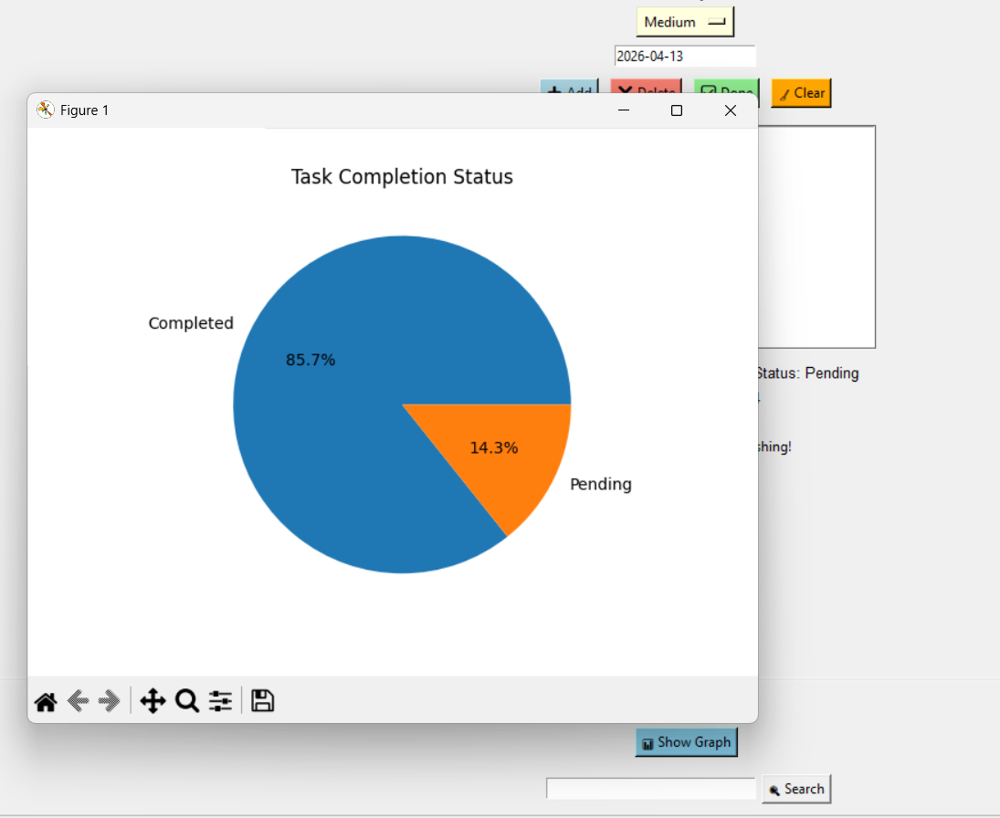
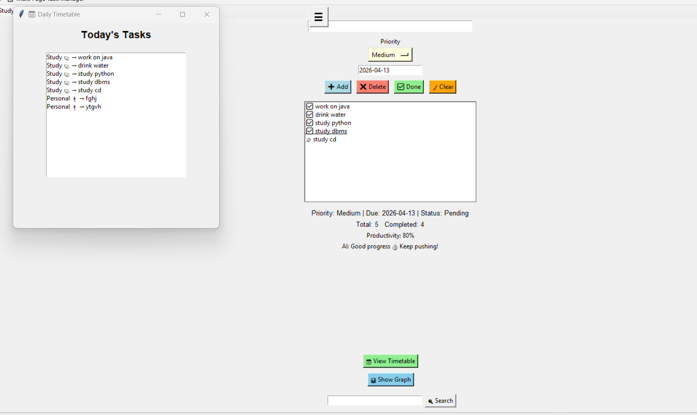
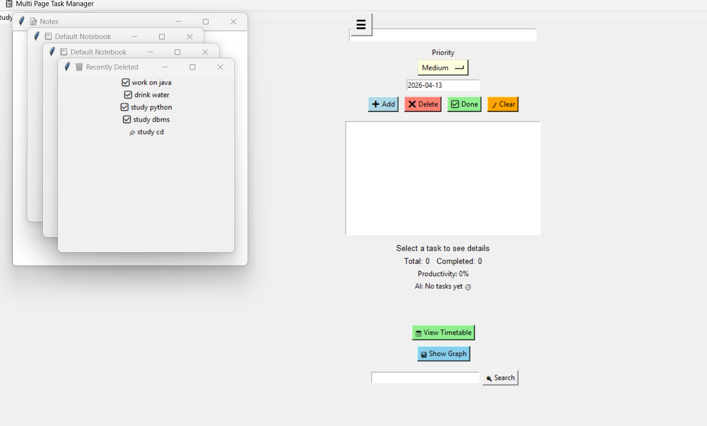
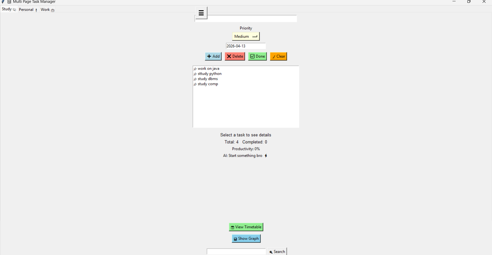

📋 Smart Multi-Page Task Manager

🚀 Project Overview

This is a multi-page task management application built using Python and Tkinter.
It helps users organize tasks efficiently with categories like Study, Personal, and Work.

---

✨ Features

- 🗂 Multi-page task categorization
- 🎯 Priority levels (High, Medium, Low)
- 📅 Due date tracking
- ✅ Task completion marking
- 📊 Productivity analysis graph
- 🤖 AI-based motivational suggestions
- 📋 Task details view
- 📅 Timetable view
- 🗑 Deleted tasks tracking

---

🛠 Technologies Used

- Python
- Tkinter (GUI)
- JSON (for data storage)

---

💡 Why this project?

This project is designed to help students manage their daily tasks more effectively compared to simple notes apps.

---

🎥 Demo Video

https://drive.google.com/file/d/16veJKX6q_cbfdOsEARoaUSOjWIiAzvZ3/view?usp=drivesdk

---

📸 Screenshots

### Home Page

### Task Page

### Graph Page

### Timetable Page

---

📌 How to Run

1. Download the code
2. Run the file:

python taskmanager.py

---

⭐ Conclusion

This project demonstrates UI design, task management logic, and user productivity features in a simple desktop application.
